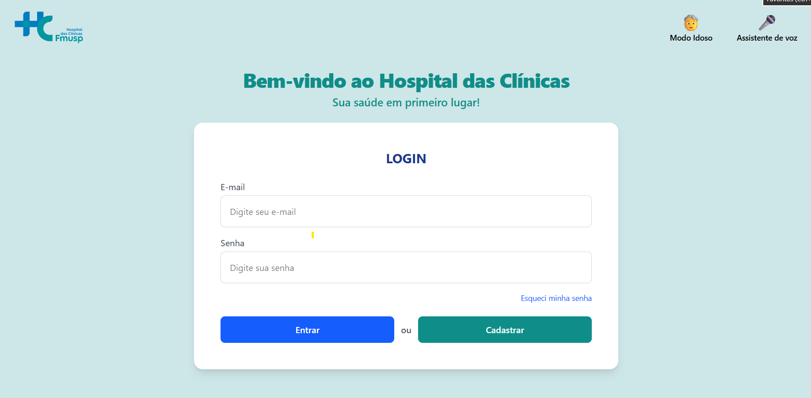
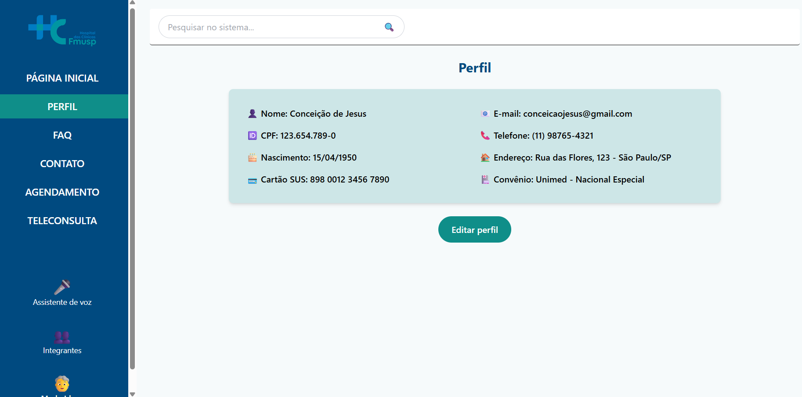
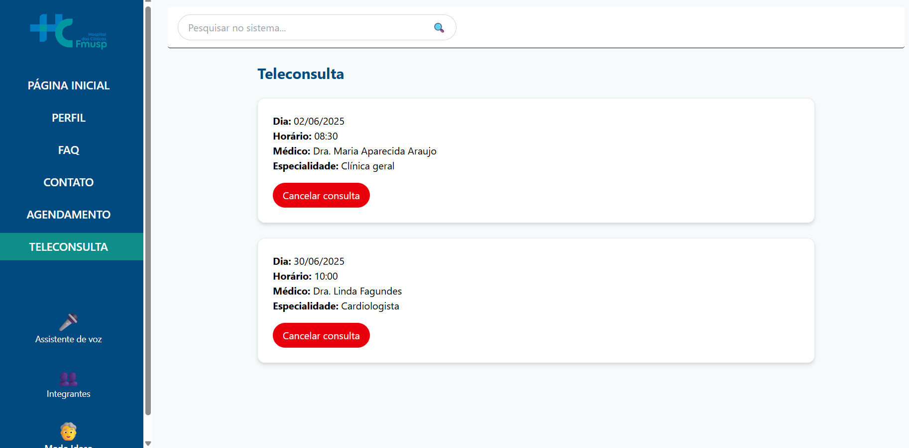
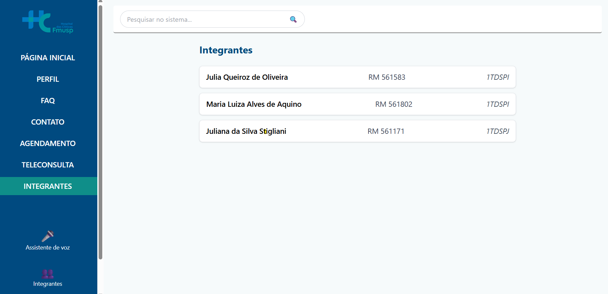
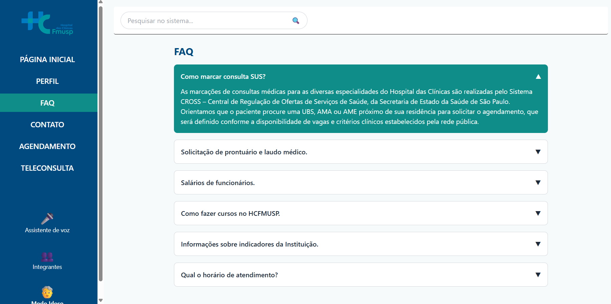
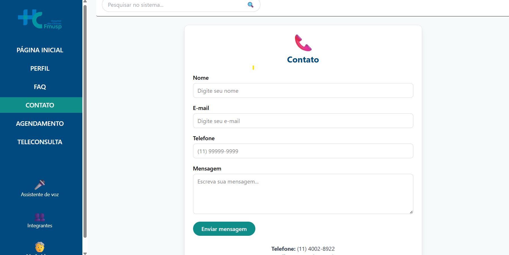
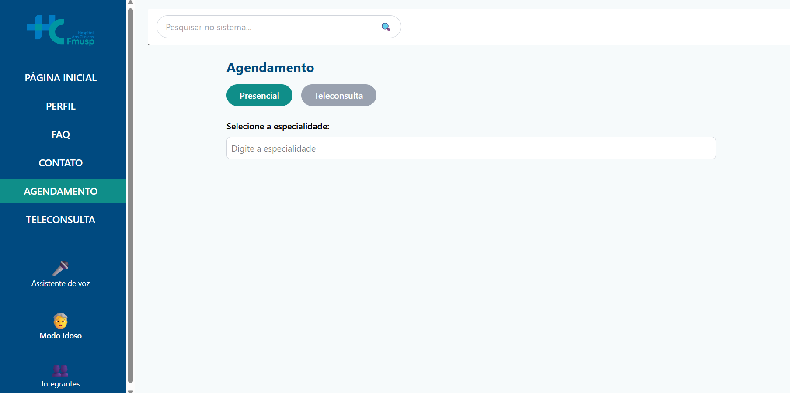
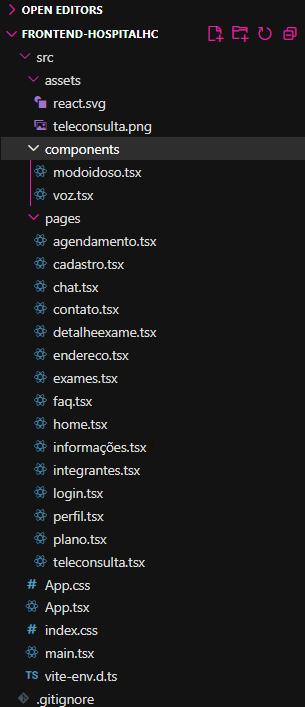

# 🏥 Hospital HC - Front-End

Projeto desenvolvido para a disciplina **Front-End Design Engineering** (FIAP) – 2º semestre.  
Este repositório contém a implementação do front-end do sistema **Hospital HC**, incluindo telas de login, cadastro, perfil, teleconsulta, agendamento,Informações, Plano de saúde,Assistente virtual, Endereço FAQ e contato, com foco em acessibilidade (Modo Idoso e Assistente de Voz).

---

## 🚀 Tecnologias Utilizadas
- [React](https://react.dev/) com TypeScript
- [Vite](https://vitejs.dev/) para build e execução
- [Tailwind CSS](https://tailwindcss.com/) para estilização
- [React Router DOM](https://reactrouter.com/) para navegação
- [React Hook Form](https://react-hook-form.com/) para validação de formulários
- Ícones, emojis e imagens para acessibilidade e usabilidade

---

## 👩‍💻 Integrantes
- **Julia Queiroz de Oliveira** – RM 561583 – 1TDSPI  
- **Maria Luiza Alves de Aquino** – RM 561802 – 1TDSPI
- **Juliana da Silva Stigliani** – RM 561171 – 1TDSPJ  

---

## 🖼️ Imagens do Projeto
### Tela de Login

### Tela de Perfil

### Tela de Teleconsulta

### Tela de Integrantes

### Tela de FAQ

### Tela de Contato

### Tela de Agendamento

---

## 📂 Estrutura de Pastas

---

## 🔗 Links
- **Repositório no GitHub:** [Clique aqui](https://github.com/challengeFront/hospitalHC-frontend)  
- **Vídeo de Apresentação (YouTube):** [Clique aqui](https://youtu.be/e3rMbY_H3xY) 

---

## 📹 Vídeo de Demonstração
O vídeo de até **3 minutos** apresenta:
- As telas do sistema (login, cadastro, perfil, teleconsulta, agendamento, FAQ, contato e integrantes)  
- Principais recursos (Modo Idoso, Assistente de Voz, formulários com validação)  
- Layout responsivo, usabilidade e acessibilidade  

---

# Objetivo da Solução  
O código fonte do sistema tem como objetivo oferecer uma solução simples e 
funcional para o gerenciamento de informações no contexto hospitalar. Ele permite o 
cadastro de pacientes, prontuários e agendamentos, além de oferecer recursos de 
acessibilidade e interação com o usuário. 
O escopo está limitado às operações básicas de registro, consulta, 
atualização e exclusão de dados referentes a pacientes e agendamentos, 
garantindo uma interface interativa via console. 

---

 
